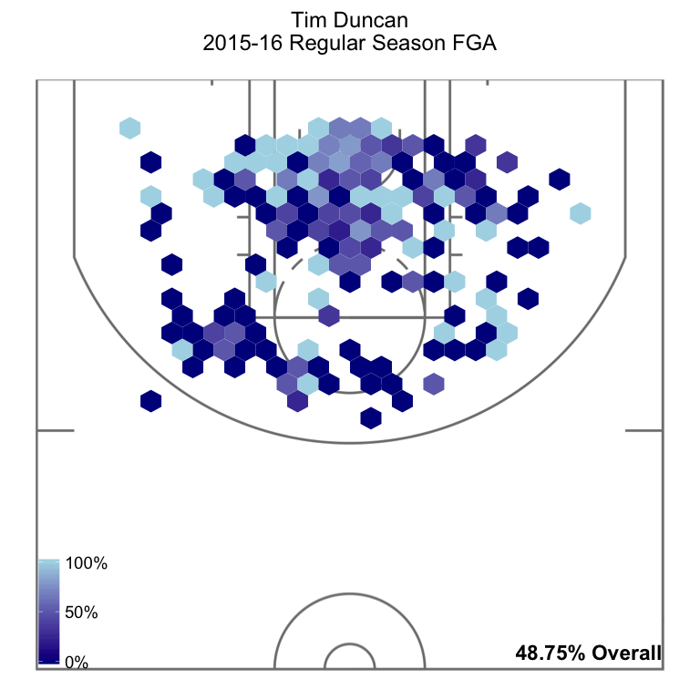
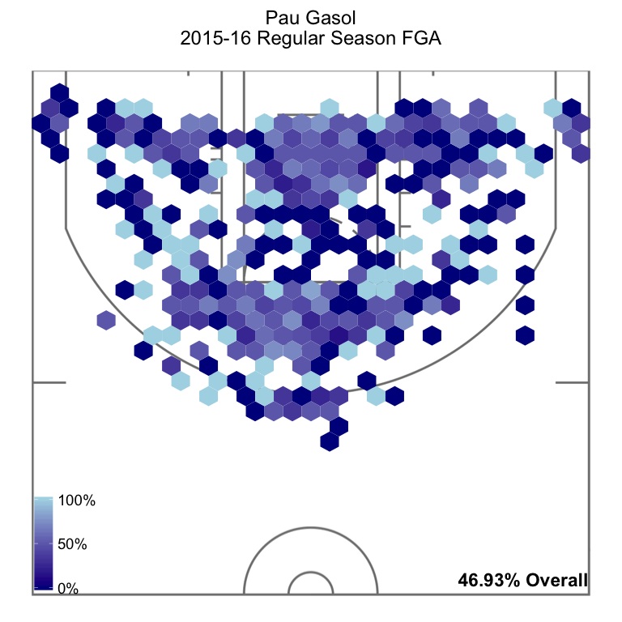
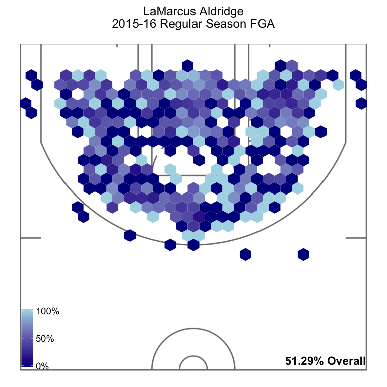
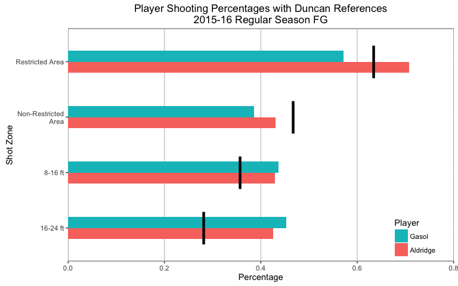

# Duncan / Gasol
Joe Willage  
August 4, 2016  

It's been an emotional summer for the Spurs as they bid goodbye to the man who was an embodiment of the organization for nearly two decades. While there's no replacing what Tim Duncan brought every night for the Spurs, their front office did its job as the team transitions to a new look front court. Here we'll explore what the team loses and gains going into next season, and some options to make the most of the situation.  

When I initially pulled the data[^1], I thought there had been a mistake. The data contains every shot taken by every player last season: 207,895 attempts in all. James Harden led all players with 1,617. Steph Curry was next with 1,598. But for Duncan, there were only 441 shots. I thought that couldn’t be right, but it was. Tim played 61 regular season games, and averaged 7.2 FGA/game. He indeed had just 441 shot attempts last season. Here’s Duncan’s shot chart over the entire regular season (note: 1 shot from behind half-court omitted).  

It's no surprise that Timmy's strongest areas are in the paint, especially within the restricted area, and especially to the left of the rim. 39% of Duncan's shots last season came from the restricted area, which he converted at a 63.5% clip[^2]. From the rest of the painted area he cooled down a bit, shooting 35% of his shots from there, converting at a 46.8% rate. Unsurprisingly, Tim's numbers drop as the shot attempts move further out; from 8-16 ft he converted 35.7% and from 16-24 ft he converted 28.2%. There were 2 failed attempts from beyond the arc, but it's Tim Duncan, and he made it [when it counted](https://www.youtube.com/watch?v=trdsKp94Io0). 

His 48.8% overall field goal percentage for the season was pretty good compared to the league average of 45.2%.

Adding in his 1.5 made free throws per game[^3], Duncan ended up contributing 8.6 PPG in the 2015-16 season, by far his lowest. While it's true that he also played the fewest minutes of his career (25.2 MPG), his individual points per minute suffered a career low, finishing at 0.34 (his career high was 0.63 iPPM in 2001-02)[^4]. While seeing Timmy retire might be the low point of my life, it was probably for the best. But he went out fighting, and I love that.  

That brings us to the coming season. While the Spurs didn't accomplish their number one goal of signing Kevin Durant, they still did very well in securing free agent Pau Gasol. Gasol's numbers during his two seasons with Chicago makes it look like he'll be a great fit on paper for the Spurs in Duncan's absence.  

To start with, Gasol attempted 995 shots, more than twice as many as Duncan. Take that number with a grain of salt; it's tough to normalize, but consider that Duncan started alongside the likes of LaMarcus Aldridge, Tony Parker, Kawhi Leonard, and Danny Green. Gasol started alongside a rotating cast of Jimmy Butler, Derrick Rose, Taj Gibson, E'Twaun Moore, Mike Dunleavy, Nikola Mirotic, Tony Snell, and Bobby Portis. There was definitely more basketball to go around for the Bulls last season than for the Spurs (an interesting problem that Rose will have to face coming into New York this year). So it follows that when Gasol had the ball, he shot it more than Duncan.  

Gasol had an overall FG% last season of 46.9%, less than Tim's 48.8%. His iPPM of 0.52 is higher than Tim's, indicating that he was shooting more frequently. Here is Gasol's 2015-16 shot chart.  

What immediately stands out here are the spots outside the three point arc. Gasol attempted 69 threes last season (0.96/gm), and converted 34.8% of them. Factoring in his made threes, Gasol's eFG% is 48.1%, closer, but still below Tim's (48.8%). 

Looking at the chart, Gasol *appears* to be pretty good from the restricted area, but not as good as Duncan. He took 27% of his shots from there, and converted at a 57.2% clip. That's actually lower than the league average for the season, which was 60.2%. In the paint outside the RA, Gasol attempted 18% of his shots, making a dismal 38.6% of them. Fortunately, he's better further out. From 8-16 ft, Gasol converted 43.6%. From 16-24 ft, that number increases to 45.2%.  

So with the addition of Gasol, the Spurs have a surplus of relatively efficient shooting from mid-range. They're going to miss Duncan's offensive presence around the rim, where they'll hopefully limit the number of shots Gasol takes. It's a gap they should be able to fill with Aldridge. 

LaMarcus' numbers were solid from all over the court last season (except from downtown); he averaged an overall 51.3 FG%. In the restricted area he shot a stellar 70.8%. Here is how Aldridge and Gasol's shooting percentages compare from different areas on the floor. The black reference bars are Duncan's numbers.  

Aldridge's numbers in the paint are good news for the Spurs. They may be able to move him into more of a center position on offense, and keep Gasol further back, where he can hit those mid-to long-range shots and the occasional three.  

That leaves us with a model where Aldridge replaces Duncan, and Gasol replaces Aldridge. Let's see how that might play out. LaMarcus will likely see the same amount of minutes as he did last season. Now, to better model his hypothetical contributions at center, let's flip the percentage of mid-to long-range shots he took with his percentage of shots in the paint (we'll assume he continues to take [miss] the same number of threes as last season, and that he converts shots for a given area at the same rate he did last season). That would be 6.8 mid-range shots * 43.6% = 6 mid-range PPG. And then we get the paint numbers: 7.1 paint shots * 60.9% = 8.6 paint PPG. Add in his free throws (let's hope he doesn't inherit Tim's FT% here), and we're looking at a total of 18.1 PPG from Aldridge. For Gasol, we'll assume he plays starter minutes like he did last season. That results in 16.4 PPG.  

Those numbers are very close to what they were for both players last season, however, this gives the Spurs a front court that can shoot from almost anywhere on the floor. Aldridge is listed as 6'11", the same height as Tim, and 10 pounds leaner, at 240 lbs. He should be able to consistently play at center. Gasol has taken heat throughout his career of being soft, moving him to the 4 might help that. One thing I'm unsure about is if he has enough speed to play the position on offense.  

I'm hesitant to explore how this affects the Spurs' total points, since there's no telling what's going to happen with bench minutes. It's very possible that Gasol could get the same minutes he did last season with Chicago, 31.8, since that's about what Aldridge got. Regardless of how Popovich manages his team's minutes, it looks like if the Spurs stay healthy they'll be able to cover on offense what they lose with Duncan.  

Of course, there's no replacing the intangibles that Timmy brought on the court and off it.  

[^1]: NBA Shot Chart API. http://stats.nba.com/stats/shotchartdetail

[^2]: Throughout the article, percentages of shot distributions are rounded to the nearest integer. Shooting percentages and average points are rounded to the nearest tenth. All calculations were performed using the full numbers.  

[^3]: http://stats.nba.com/player/#!/1495/  

[^4]: Individual Points Per Minute (iPPM) is calculated as the player's points per game/minutes per game. Essentially, the rate at which the player scores points, while on the floor.  
