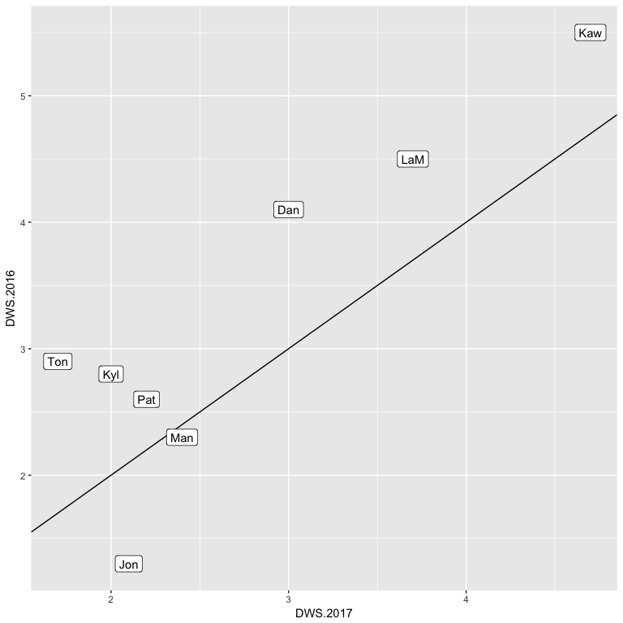
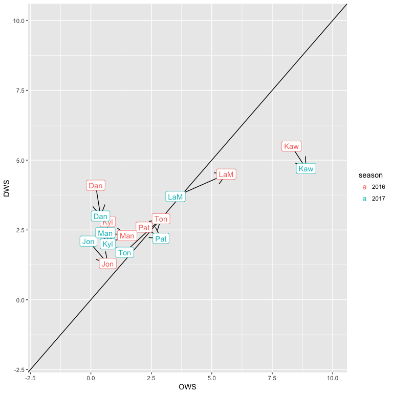

# Pausol2
Joe Willage  
July 21, 2017  

Overall - did the Spurs get offense similar to 2015-16? Team PPG increased from 103.5 to 105.3. 
But the overall leauge PPG increased from 106.4 to 108.8. The 2015-16 Spurs were already scoring less than the league average, 
and they lost even more ground in 2016-17. Their offense went from #4 at 110.3 to #9 at 111.1. 
(Their defense also down, as they went from allowing 92.9 PPG to allowing 98.1. 
Though they were still the top defensive rated team. ) 

  
looking at at offense and defense, we see just a couple of players who improved from 2016 to 2017

<!-- --><!-- -->

And just for fun, comparing offense against defense confirms what we know about Pop's Spurs: they rest their hat on defense. '

<!-- -->

<!-- -->
As seen in the graph, Aldridge's numbers dropped across the board, while Gasol's mostly improved (similarly represented in their respective eFG%).
Let's see how the team fared against the rest of the league'

<!-- -->

spursShotSummary <- summarizeDistance(spurs)
leagueShotSummary <- summarizeDistance(league)

relativeShotSummary <- mapply(function(x, y)  x - y,
       spursShotSummary,
       leagueShotSummary)

relativeShotSummary[grepl("pct", names(relativeShotSummary))]*100

Relative to the rest of the league, the Spurs overall underperformed scoring in the paint. 
They got better the further out they shot, beating the league by 3.3% from 16-24 ft (eye roll), 
and 1.1% from 3.

And so went the regular the season. Into the playoffs the Spurs kept scoring at around the same rate.
That worked fine against their first two opponents, who SA held to sum(82, 82, 105, 110, 103, 96)/6 (96)
and sum(126, 96, 92, 125, 107, 75)/6 (104) PPG. But it won't cut it if their defense collapses,
as every team's does, when they play the Warriors.
