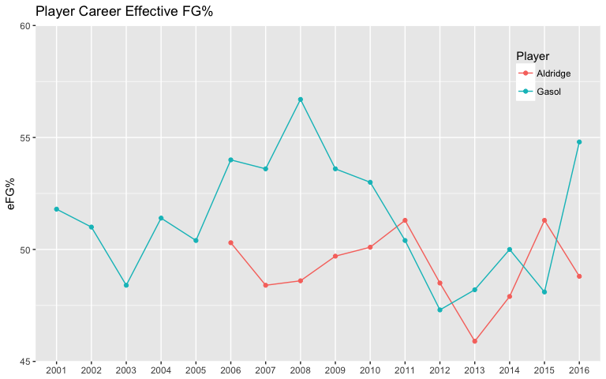
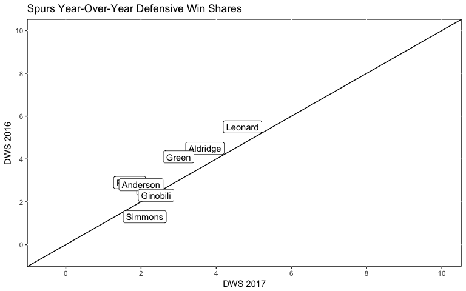

# Pausol2
Joe Willage  
July 21, 2017  

It hasn't been the best summer for Spurs fans. A third round sweep, losing key talent, failing to sign big-name free agents. Unhappy players. Devasting injuries. Etc. 

But that's life. 

Pau Gasol re-upped with the team for 3 years, and LaMarcus Aldridge is still a Spur, for now. Last year I predicted how that front court might fare over the season. I'll be evaluating that, as well as examining how the team performed in general, as it relates to scoring. 

###PLAYERS###

Allow me philosophize for a moment. When thinking about the future, we typically tap into a recency bias. How a team will perform in the upcoming season equals how they performed the previous season plus or minus offseason transactions. But it's not that simple. Players' performance isn't a straight line from the end of one season to the start of the next. It's not even a straight line within in a single season; players have a career game followed by an abysmal one, in any sport. Those microtrends are part of the entropy of sports, and a large part of what makes it fun to be a fan. But it's also a small slice of a larger picture - one that encapsulates a player's entire career, or a franchise's history. It's not different than the stock market. Looking at a symbol over the last month generally shows wild fluctuations. But zooming out to the last 5 years, the line becomes smoother and the trends surface. 

That's the grain of salt. 

<!-- -->

Taking into account his entire career, Aldridge isn't really moving the needle much on his effective FG% from one season to the next. He's got a 49% total eFG%. Gasol, on the other hand, has had some large swings over his longer career. His first 8 years were similar to Aldridge's, no huge fluctuations. His numbers had an upswing when he was traded to the Lakers in '08, then slowly dropped throughout his time there. He had another (smaller) upswing his first year on the Bulls, then dropped, and then another upswing his first year on the Spurs. Spurs fans will hope Pau can buck the trend and keep shooting at a high percentage. 

The Aldridge/Gasol front court had mixed results relative to their previous individual seasons. As seen in the graph, Aldridge's numbers dropped across the board, while Gasol's mostly improved. 

<!-- -->

###TEAM###

That only tells a small part of the story. Overall, did the Spurs get offense similar to 2015-16? While the team's points per game increased from 103.5 to 105.3, the league average PPG increased from 106.4 to 108.8. The 2015-16 Spurs were already scoring less than the rest of the league, and they lost even more ground in 2016-17. Their offense dropped down the ranks, from #4 to #9. 

  
We'll compare year over year for offensive win shares, which attempts to quantify how many wins a player's offense bought their team. Players who fall on the left of the line decreased, while players on the right of the line increased their OWS. This is limited to just the eight players who played the past two seasons. 

<!-- -->

Mills and Leonard are the only ones who showed noticeable improvment from 2016 to 2017. Everyone else showed similar or worse performance (looking at you, LaMarcus). 

**Bonus content**: Their defense also down, as they went from allowing 92.9 PPG to allowing 98.1. 
Though they were still the top defensive rated team. 

<!-- -->

###LEAGUE###
Let's see how the team's scoring fared against the rest of the league, by location. All areas here are relative to the leauge average. So a blue hexagon representing 80% suggests that the Spurs shot 80% better than the league, for instance 90% vs 10%. That's an extreme case, and I don't want to focus on individual hexagons, which represent a very small, specific location on the court. Instead, study the trends by area - large swaths of similar percentages. 

<!-- -->

Relative to the rest of the league, the Spurs underperformed scoring in the paint. 
They got better the further out they shot, beating the league by 3.2% from 16-24 ft 🙄, 
and 1.1% from 3.

And so went the regular the season. Into the playoffs the Spurs kept scoring at around the same rate.
That worked fine against their first two opponents, who SA held to 96.3
and 103.5 PPG. But it won't cut it if their defense collapses,
as every team's does, when they play the Warriors.

##
TODO:
And even Bayesian logic takes into account previous stats as priors. 
